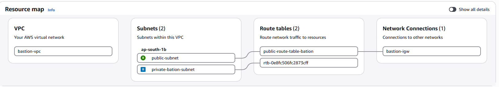
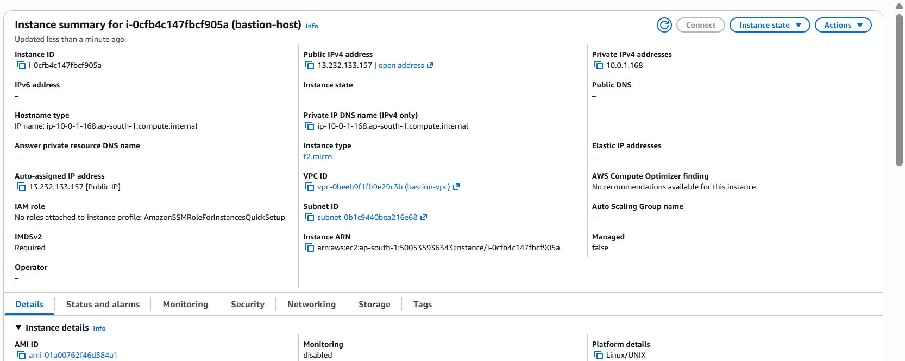
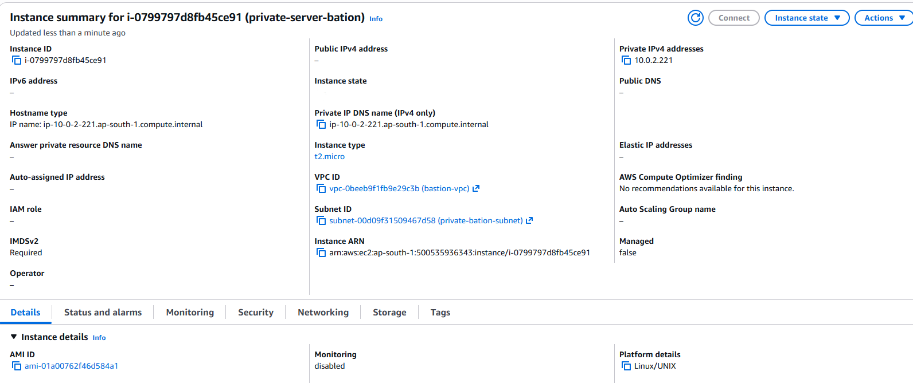
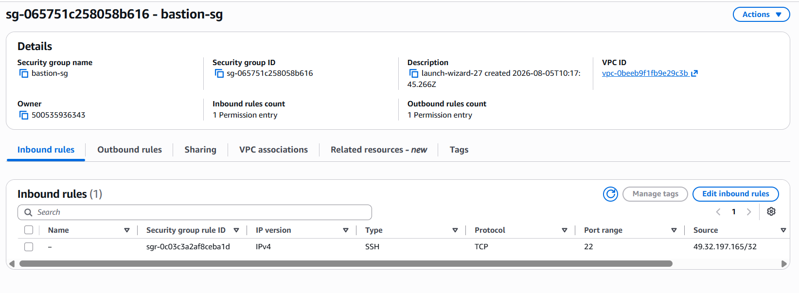
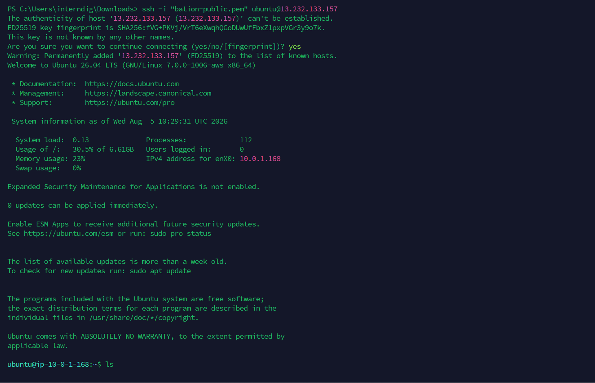
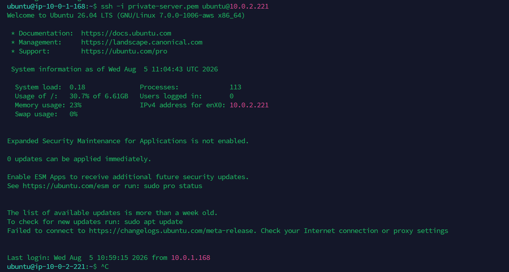
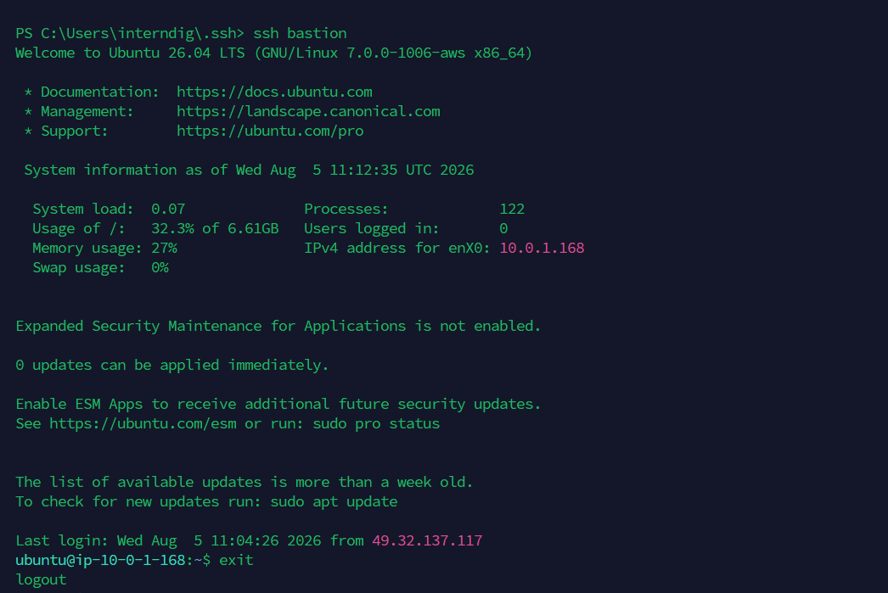
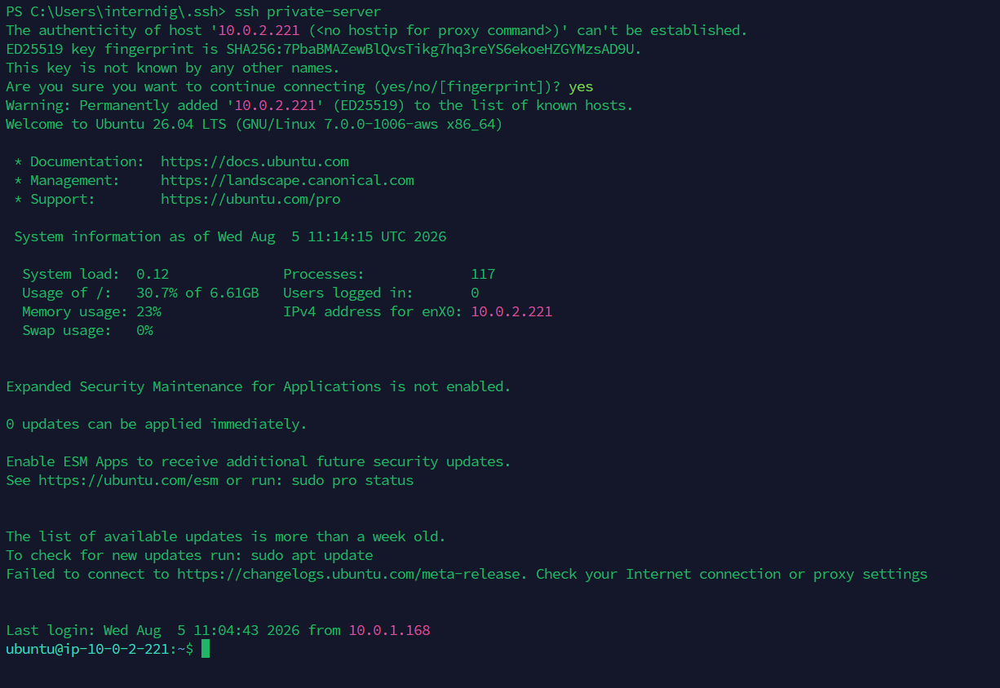

# Bastion Host on AWS

## Project Overview

This project demonstrates how to securely access private infrastructure using a Bastion Host on AWS.

A Bastion Host is a publicly accessible EC2 instance that acts as the only entry point to a private network. The private server has no public IP address and can only be accessed through the Bastion Host using SSH.

This architecture improves security by preventing direct internet access to private resources.

---

# Architecture

```
                  Internet
                      |
                 SSH (Port 22)
                      |
                +----------------+
                |  Bastion Host  |
                | Public Subnet  |
                +----------------+
                      |
                 SSH (Port 22)
                      |
                +----------------+
                | Private Server |
                | Private Subnet |
                +----------------+
```

---

# AWS Resources Created

The following AWS resources were created for this project:

- Virtual Private Cloud (VPC)
- Public Subnet
- Private Subnet
- Internet Gateway
- Public Route Table
- Private Route Table
- Bastion Host EC2 Instance
- Private EC2 Instance
- Security Groups
- SSH Configuration using ProxyJump

---

# Network Configuration

A dedicated VPC was created with separate public and private subnets.

### VPC

- CIDR Block: `10.0.0.0/16`

### Public Subnet

- CIDR Block: `10.0.1.0/24`
- Hosts the Bastion Host
- Connected to the Internet Gateway

### Private Subnet

- CIDR Block: `10.0.2.0/24`
- Hosts the Private Server
- No Public IP assigned

### Network Screenshot



---

# Internet Gateway

An Internet Gateway was attached to the VPC to provide internet access only to the public subnet.

The private subnet has no direct internet access.

---

# Route Tables

## Public Route Table

Configured with:

| Destination | Target |
|-------------|--------|
| 0.0.0.0/0 | Internet Gateway |

This allows the Bastion Host to be reachable from the internet.

## Private Route Table

Configured with only the local VPC route.

No Internet Gateway route was added.

This keeps the Private Server isolated from the public internet.

---

# EC2 Instances

## Bastion Host

Configuration:

- Ubuntu Server
- Public Subnet
- Public IP Enabled
- SSH access enabled

### Bastion Host Screenshot



---

## Private Server

Configuration:

- Ubuntu Server
- Private Subnet
- Public IP Disabled
- Accessible only through the Bastion Host

### Private Server Screenshot



---

# Security Groups

## Bastion Security Group

Inbound Rule

| Type | Port | Source |
|------|------|--------|
| SSH | 22 | My Public IP |

Only my current public IP is allowed to connect to the Bastion Host.

### Security Group Screenshot



---

## Private Server Security Group

Inbound Rule

| Type | Port | Source |
|------|------|--------|
| SSH | 22 | Bastion Security Group |

The Private Server accepts SSH connections only from the Bastion Host.

---

# SSH Configuration

The SSH client was configured using the SSH config file.

```text
Host bastion
    HostName <bastion-public-ip>
    User ubuntu
    IdentityFile <path-to-bastion-key>

Host private-server
    HostName <private-server-private-ip>
    User ubuntu
    ProxyJump bastion
    IdentityFile <path-to-private-key>
```

> **Note:** Actual IP addresses and private key paths have been omitted for security reasons.

---

# SSH Connection Testing

## Method 1 – Connect directly to Bastion Host

```bash
ssh -i "bation-public.pem" ubuntu@<bastion-public-ip>
```

### Screenshot



---

## Method 2 – Connect from Bastion to Private Server

```bash
ssh -i private-server.pem ubuntu@<private-server-private-ip>
```

### Screenshot



---

## Method 3 – SSH Config (Bastion Alias)

```bash
ssh bastion
```

This command connects directly to the Bastion Host using the SSH configuration file.

### Screenshot



---

## Method 4 – SSH ProxyJump

```bash
ssh private-server
```

Using ProxyJump, SSH automatically connects to the Bastion Host first and then to the Private Server.

### Screenshot



---

# Connection Flow

```
Laptop
   │
   │ SSH
   ▼
Bastion Host
(Public Subnet)
   │
   │ SSH
   ▼
Private Server
(Private Subnet)
```

---

# Security Implemented

- Bastion Host deployed in a Public Subnet.
- Private Server deployed in a Private Subnet.
- Private Server has no Public IP.
- SSH access to the Bastion Host is restricted to my public IP.
- SSH access to the Private Server is restricted to the Bastion Security Group.
- SSH ProxyJump configured for secure access.
- Private SSH keys are not included in this repository.

---

# Validation

The following tasks were successfully completed:

- Created a custom VPC.
- Created Public and Private Subnets.
- Configured an Internet Gateway.
- Configured Public and Private Route Tables.
- Launched Bastion Host.
- Launched Private Server.
- Configured Security Groups.
- Connected to the Bastion Host using SSH.
- Connected to the Private Server from the Bastion Host.
- Configured SSH aliases using SSH config.
- Successfully connected directly using:

```bash
ssh bastion
```

and

```bash
ssh private-server
```

---

# Learning Outcomes

Through this project I learned how to:

- Design secure AWS network architecture.
- Configure VPCs, Subnets, Internet Gateway and Route Tables.
- Launch EC2 instances in Public and Private Subnets.
- Configure Security Groups using the principle of least privilege.
- Securely access private infrastructure using a Bastion Host.
- Configure SSH ProxyJump for seamless administration of private servers.
- Implement secure infrastructure without exposing private resources to the internet.

---

# Conclusion

This project successfully implements a secure Bastion Host architecture on AWS. The Bastion Host serves as the only publicly accessible entry point, while the Private Server remains isolated in a private subnet. Using SSH ProxyJump, secure access to private infrastructure is achieved without exposing sensitive resources to the public internet.

---

## Repository Note

For security reasons, this repository does **not** include:

- Private SSH keys (`.pem`)
- AWS credentials
- Actual public or private IP addresses

https://roadmap.sh/projects/bastion-host
